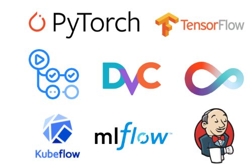

# MLOps: A Complete Introduction

Machine Learning Operations (MLOps) refers to the tools, techniques and practical experiences required to train  machine learning models and deploy and monitor them in production.

The concept of MLOps comes from DevOps, which is the existing practice of more efficiently write, deploy, and manage enterprise applications. It was designed to unite software developers (Devs) and IT operations teams (Ops) to enable better collaboration between them. MLOps shares these aims but adds the Data Scientists and also ML Engineers to the team. 

MLOps became popular due to the rise of the Data Science and Machine Learning areas in the past years. The reason for that is that Data Scientists have a strong background in statistics and programming, but they are not used to put ML models into production. This is where ML Engineers comes into picture, they have the knowledge of databases, REST APIs, and a collection of other IT skills that are needed to accomplish this task.

## The benefits of MLOps

### Simplified Deployment
The Data Science stack nowadays provides a lot of programming languages and frameworks to Data Scientists run their experiments. Therefore, MLOps enables ML Engineers to more rapidly deploy models from those many different frameworks and languages.

### ML Monitoring
Many MLOps pipelines provide model-specific metrics, detection of data drift for important features, and other core functionality.

### Lifecycle Management
It can help the team to easily test the model and its updates without disrupting business applications.

### Experiment Tracking
In Machine Learning, experiment tracking is the process of saving all experiment-related information that you care about for every experiment you run. MLOps helps Data Scientists to better organize these kinds of data using best practices.

### Reproducibility
Reproducibility in Machine Learning means that you can repeatedly run your algorithm on certain datasets and obtain the same results no matter what environment (locally or remotely) you execute this experiment. It adds value to any CI/CD pipeline and allows these activities to proceed smoothly, so in-house changes and deployments for clients become routine and not a nightmare. Building a MLOps pipeline helps Data Science teams to reduce errors and ambiguity when the projects move from development to production for example.

## How to implement MLOps:

There are three levels to be covered:
1. Level 0 - Manual Processes
2. Level 1 - ML Pipeline Automation
3. Level 2 - CI/CD Pipeline Automation

## Tools for MLOps

*Fig. XXX: The MLOps stack. Font: The author.*

<!--  -->

Data/Model pipelines: DVC, Kubeflow, MLflow
CI/CD: CML, GitHub Actions, Jenkins
Cloud: AWS, GCP and Azure