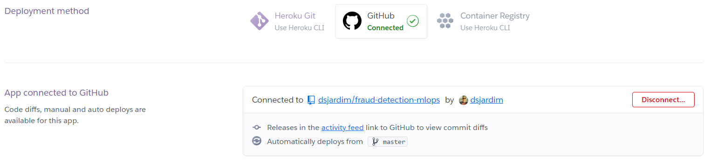
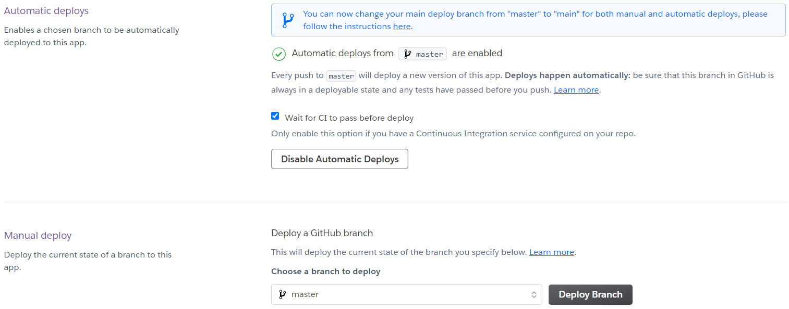

# MLOps: A Complete and Hands-on Introduction - Part 2

In the first part of this series we could explore the idea of MLOps, some of its frameworks and other tools that can be useful when we want to apply this concept in our daily bases. Although we saw some tools there, I think it deserves some hands-on examples on how it can be used on a real data science project.

The dataset we'll be using in this hands-on article is available on Kaggle, and it's called [Credit Card Fraud Detection][4]. Moreover, we added the data processing step based on this [notebook: Credit Fraud || Dealing with Imbalanced Datasets][5], that is available on Kaggle as well.

Here we will be using GitHub for hosting our repository, [Data Version Control][1] (DVC) for managing and reproducing the data science pipeline we are going to build. In addiction, we are going to store within a S3 bucket all the data that are too big to be tracked by Git, such as our models and the dataset. 

Following the MLOps principles, we are going to use [GitHub Actions][2] to automate all our development workflow, and we will integrate the repository with [Heroku][3] in order to automatically deploy our API and serve our model. With that being covered, in the next few sections we will dive into this very simple MLOps pipeline and see how can we implement the concepts we learnt before.

## Getting the dataset

First things first, we can't do anything without being able to access our dataset. So, we have to develop a routine that can help us in downloading the data from our S3 bucket.
The following code snippet do the trick for us, the method takes as parameters the name of your bucket (bucket_name), the object key (key), and the destination (dst) where you'd like to store the data locally.

```python
 import boto3
 import botocore
 
 def download_data_from_s3(bucket_name, key, dst):
    try:
        s3 = boto3.resource('s3')
        s3.Bucket(bucket_name).download_file(key, dst)
    except botocore.exceptions.ClientError as e:
        if e.response['Error']['Code'] == "404":
            print("The object does not exist.")
        else:
            raise
 ```

To make our lives easier, we've created a script called ```download_dataset.py``` to be used as the first step of our pipeline managed by DVC. 
In this script, we are just defining the information we need to use the ```download_data_from_s3``` method in order to download the dataset.

## Data Preparation and Model Training

The next step in our pipeline is data preprocessing, followed by the model training and validation steps.
For the first part, we've created a script called ```preprocessing.py```, and within it, we have several data processing methods we can use, such as data sampling, outliers detection and missing values treatments and dimensionality reduction. It's important to highlight that all these methods were extracted on this public [notebook][5] available on Kaggle.

Our develop pipeline ends with the ```train.py``` script, and you can easily access to the full code in [here][6]. There, we put all the steps together and link them all. Therefore, after downloading the dataset, we go through the preprocessing step in order to treat outliers and split the original data into subsets of data.

After that, we define a model to be trained and also its hyperparameters search space that a GridSearchCV method uses to find the best hyperparameters values for the chosen model. Then, we train this model using this hyperparameters, and go through a validation step in order to check whether our model is performing well in the validation dataset.

The last thing we do in the ```train.py``` script is gathering some model metrics, and we save both the trained model and its performance metrics after test it on the validation dataset.

## MLOps Reproducibility

Until now, we haven't seen a MLOps pipeline, but a traditional data science one. So it's time to configure the DVC in order to make our work reproducible in any other environment.
Therefore, all we have to do is to create a ```YAML``` file containing the following script.

```yaml
stages:
  download_data:
    cmd: python src/download_dataset.py
    deps:
      - src/download_dataset.py
    outs:
      - data/creditcard.csv
  train_clf:
    cmd: python src/train.py
    deps:
      - src/train.py
      - data/creditcard.csv
    outs:
      - data/confusion_matrix.png
      - data/model.pickle
    metrics:
      - data/metrics.json:
          cache: false
```

By doing that, we're dividing the pipeline into stages, where each is responsible for the execution of a specific part of the project. Moreover, we also have to define the dependencies and outputs of each stage. In this article, we have two stages: **download_data** and **train_clf**. The first one executes the ```download_dataset.py``` script, and the second one runs the ```train.py```. So, we put them in the correct order of execution and specify their requirements. For more details, you can check the [DVC Repro Documentation][7].  With that, we can execute your entire pipeline in any other environment by just opening a terminal on the root directory of the project and type the command ```dvc repro```.

So far so now, we have built a pipeline and made it ready to run anywhere, linking its dependencies and specifying the outputs. Now, we can use it to integrate this with GitHub Actions in order to generate insights to be used in a decision-making process, for example, whether to approve or not a Pull Request.

GitHub Actions uses YAML syntax to define the events, jobs, and steps. These ```YAML``` files are stored in your code repository, in a directory called ```.github/workflows```. And our workflow look like this:
```yaml
name: credit-fraud-detection-flow
on: [ push ]

jobs:
  experiment-run-tests:
    runs-on: ubuntu-latest
    strategy:
      matrix:
        python-version: [ 3.8 ]

    steps:
      - uses: actions/checkout@v2
      - uses: iterative/setup-cml@v1
      - uses: iterative/setup-dvc@v1
      - uses: aws-actions/configure-aws-credentials@v1
        with:
          aws-access-key-id: ${{ secrets.AWS_ACCESS_KEY_ID }}
          aws-secret-access-key: ${{ secrets.AWS_SECRET_ACCESS_KEY }}
          aws-region: ${{ secrets.AWS_DEFAULT_REGION }}

      - name: Set up Python ${{ matrix.python-version }}
        uses: actions/setup-python@v1
        with:
          python-version: ${{ matrix.python-version }}

      - name: Install dependencies
        run: |
          python -m pip install --upgrade pip
          pip install --no-cache-dir -r requirements.txt

      - name: Run Experiment
        env:
          repo_token: ${{ secrets.GITHUB_TOKEN }}
        run: |
          dvc repro

          echo "## Metrics" >> report.md
          git fetch --prune
          dvc metrics diff master --show-md >> report.md

          # Publish confusion matrix diff
          echo -e "## Plots\n### Confusion matrix" >> report.md
          cml-publish data/confusion_matrix.png --md >> report.md

          cml-send-comment report.md

      - name: Run tests
        run: |
          pytest --cov-report=term-missing --cov=src --cov-fail-under=0
          pytest --cov-report=html --cov=src

      - name: Upload coverage report
        uses: actions/upload-artifact@v2
        with:
          name: coverage-report
          path: htmlcov/
          retention-days: 5
```

We begin by naming the workflow and defining when it will be triggered. Then, we specify the jobs and, for each job, we define the steps to be executed. You can think the steps as docker containers used to execute something. So, in each step we have to define the ```actions```, and here we are using 5 actions in total:
- ```actions/checkout@v2``` checks-out our repository under workspace, so the workflow can access our project.
- ```iterative/setup-cml@v1``` sets up CML in the workflow.
- ```iterative/setup-dvc@v1``` sets up DVC in the workflow.
- ```aws-actions/configure-aws-credentials@v1``` configures the AWS credential and region environment variables to be used in the workflow.
- ```actions/setup-python@v1``` sets up a Python environment

One of the jobs we have in the workflow we've created for this article, is called ```experiment-run-tests```, and within it, we set the actions specified before so that we can be able to run the DVC pipeline we've created previously. By doing that, our pipeline will be executed remotely and its outputs (the ```confusion_matrix.png``` and ```metrics.json```) will be used by CML to generate a report to be used in the decision-making process we mentioned before. 

Now, whenever someone modifies anything on the code and open a Pull Request, in addiction to the code diff, we will have visual information about the model performance after these modifications, such as improvements on metrics comparing to the ```master``` branch and also confusion matrix plots, both cases are illustrated in Fig. 1 and Fig. 2.


*Fig. 1: Metrics comparison. Font: The Author.*

<!--  -->


*Fig. 2: Confusion Matrix generated on validation step. Font: The Author.*

<!--  -->

## Model Deploying and Serving

```
web: uvicorn src.app:app --host=0.0.0.0 --port=${PORT:-5000}
```



*Fig. 3: Heroku App Setup. Font: The Author.*

<!--  -->



*Fig. 4: Heroku Automatic Deploy. Font: The Author.*

<!--  -->


[1]: https://dvc.org/
[2]: https://github.com/features/actions
[3]: https://dashboard.heroku.com/apps
[4]: https://www.kaggle.com/mlg-ulb/creditcardfraud
[5]: https://www.kaggle.com/janiobachmann/credit-fraud-dealing-with-imbalanced-datasets
[6]: https://github.com/dsjardim/fraud-detection-mlops/blob/master/src/train.py
[7]: https://dvc.org/doc/command-reference/repro