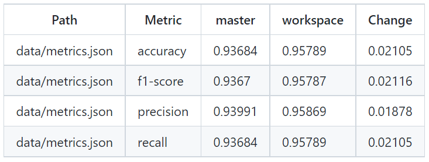
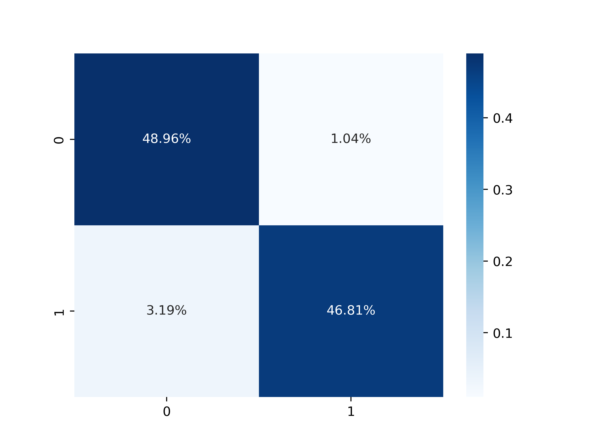

# MLOps: A Complete and Hands-on Introduction - Part 2

In the first part of this series we could explore the idea of MLOps, some of its frameworks and other tools that can be useful when we want to apply this concept in our daily bases. Although we saw some tools there, I think it deserves some hands-on examples on how it can be used on a real data science project.

The dataset we'll be using in this hands-on article is available on Kaggle, and it's called [Credit Card Fraud Detection][4]. Moreover, we added the data processing step based on this [notebook: Credit Fraud || Dealing with Imbalanced Datasets][5], that is available on Kaggle as well.

Here we will be using GitHub for hosting our repository, [Data Version Control][1] (DVC) for managing and reproducing the data science pipeline we are going to build. In addiction, we are going to store within a S3 bucket all the data that are too big to be tracked by Git, such as our models and the dataset. 

Following the MLOps principles, we are going to use [GitHub Actions][2] to automate all our development workflow, and we will integrate the repository with [Heroku][3] in order to automatically deploy our API and serve our model. With that being covered, in the next few sections we will dive into this very simple MLOps pipeline and see how can we implement the concepts we learnt before.

## Getting the dataset

First things first, we can't do anything without being able to access our dataset. So, we have to develop a routine that can help us in downloading the data from our S3 bucket.
The following code snippet do the trick for us, the method takes as parameters the name of your bucket (bucket_name), the object key (key), and the destination (dst) where you'd like to store the data locally.

```python
 import boto3
 import botocore
 
 def download_data_from_s3(bucket_name, key, dst):
    try:
        s3 = boto3.resource('s3')
        s3.Bucket(bucket_name).download_file(key, dst)
    except botocore.exceptions.ClientError as e:
        if e.response['Error']['Code'] == "404":
            print("The object does not exist.")
        else:
            raise
 ```

To make our lives easier, we've created a script called ```download_dataset.py``` to be used as the first step of our pipeline managed by DVC. 
In this script, we are just defining the information we need to use the ```download_data_from_s3``` method in order to download the dataset.

## Data Preparation and Model Training

The next step in our pipeline is data preprocessing, followed by the model training and validation steps.
For the first part, we've created a script called ```preprocessing.py```, and within it, we have several data processing methods we can use, such as data sampling, outliers detection and missing values treatments and dimensionality reduction. It's important to highlight that all these methods were extracted on this public [notebook][5] available on Kaggle.

Our develop pipeline ends with the ```train.py``` script, and we present its main method on the following code snippet.

```python
def main():
    data = pd.read_csv("data/creditcard.csv")
    data_dict = prepare_dataset(data, False)

    X_train = data_dict["X_train"]
    X_valid = data_dict["X_valid"]
    y_train = data_dict["y_train"]
    y_valid = data_dict["y_valid"]

    model_name = "random_forest"

    if model_name == "logistic_regression":
        model = LogisticRegression()
        parameters = {
            "penalty": ['l1', 'l2'],
            'C': [0.001, 0.01, 0.1, 1, 10, 100, 1000]
        }
    else:
        model = RandomForestClassifier()
        parameters = {
            'n_estimators': [500],
            'max_depth': [50],
            'max_leaf_nodes': [100]
        }

    print(model)

    grid_clf = GridSearchCV(
        estimator=model,
        param_grid=parameters,
        n_jobs=1,
        scoring='neg_mean_squared_error',
        verbose=2,
        refit=True
    )

    grid_clf.fit(X_train, y_train)
    clf = grid_clf.best_estimator_

    pred_y = clf.predict(X_valid)
    clf_rep = classification_report(y_valid, pred_y, output_dict=True)

    cm = confusion_matrix(y_valid, pred_y, normalize='true')
    hm = sns.heatmap(cm / np.sum(cm), annot=True, fmt='.2%', cmap='Blues')
    fig = hm.get_figure()
    fig.savefig('data/confusion_matrix.png', dpi=400)

    metrics_out = {
        "accuracy": clf_rep["accuracy"],
        "precision": clf_rep["weighted avg"]["precision"],
        "recall": clf_rep["weighted avg"]["recall"],
        "f1-score": clf_rep["weighted avg"]["f1-score"]
    }

    with open('data/metrics.json', 'w') as outfile:
        json.dump(metrics_out, outfile)

    with open('data/model.pickle', 'wb') as f:
        pickle.dump(clf, f)
```

In it, we put all the steps together and link them all. Therefore, after downloading the dataset, we go through the preprocessing step in order to treat outliers and split the original data into subsets of data.

After that, we define a model to be trained and also its hyperparameters search space that a GridSearchCV method uses to find the best hyperparameters values for the chosen model. Then, we train this model using this hyperparameters, and go through a validation step in order to check whether our model is performing well in the validation dataset.

The last thing we do in the ```train.py``` script is gathering some model metrics, and we save both the trained model and its performance metrics after test it on the validation dataset.

## MLOps Reproducibility

Until now, we haven't seen a MLOps pipeline, but a traditional data science pipeline. So it's time to configure the DVC pipeline in order to make our work reproducible in any other environment. 

We will also create our GitHub Actions workflow to made available automatic checks and provide insights for any further modifications on the code. 
So, whenever someone opens a Pull Request after modifying anything on the code, in addiction to the code diff, we will have visual information about the model performance after this modification, such as metrics improvements comparing to the ```master``` branch and confusion matrices.



*Fig. 1: Metrics comparison. Font: The Author.*

<!--  -->



*Fig. 2: Confusion Matrix generated on validation step. Font: The Author.*

<!--  -->

## Model Deploying and Serving


[1]: https://dvc.org/
[2]: https://github.com/features/actions
[3]: https://dashboard.heroku.com/apps
[4]: https://www.kaggle.com/mlg-ulb/creditcardfraud
[5]: https://www.kaggle.com/janiobachmann/credit-fraud-dealing-with-imbalanced-datasets
